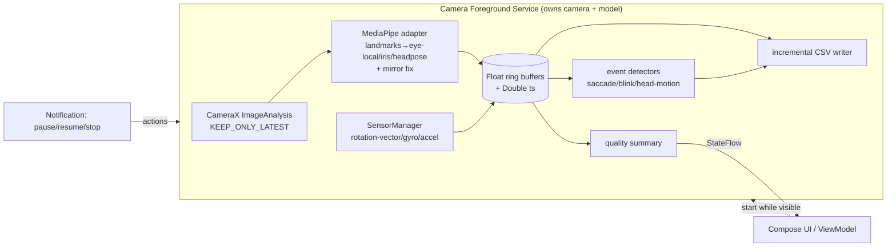

# Android software stack for Saccadacus background tracking — research report

**Research date:** 2026-06-24. **Author:** synthesised by the main agent from a
deep-research run (`wf_544dd4a8-fbd`: 5 angles, 26 sources, 103 extracted claims)
plus the committed Phase 0 repo audit (`saccadacus_phase0_audit.md`).

**Provenance / confidence tags used below:**
- **[VERIFIED 3-0]** — adversarially verified, 3 independent votes, no refutation.
- **[DOCUMENTED]** — quoted from a named primary source; *not* adversarially
  re-verified because the verifier model hit the session limit mid-run (resets
  16:40 UTC). Treat as high-confidence-but-single-pass.
- **[SECONDARY]** — community/practitioner source (e.g. dontkillmyapp.com).
- **[INFERENCE]** — my engineering judgement, not a sourced fact.
- **[NEEDS DEVICE TEST]** — only an on-device measurement can settle it.

No latency/fps/battery numbers are asserted; where one would be needed, the
benchmark that must produce it is named instead.

---

## 1. Executive recommendation

- **Primary stack:** Kotlin + **CameraX** (front-camera `ImageAnalysis`, previewless,
  bound inside a **`camera`-type foreground service**) → **MediaPipe Tasks Vision
  Face Landmarker** (478 landmarks + 52 blendshapes + facial-transform matrix,
  shipped as a **self-contained Maven library with no Google Play Services
  dependency**) → a **Kotlin signal/event pipeline ported from the browser repo's
  proven algorithms** → **incrementally written CSV**. UI: Jetpack Compose +
  ViewModel; service is started-and-bound; no DI framework (or a minimal one).
- **Fallback stack:** **Camera2** if CameraX cannot give service-owned, previewless
  control or the camera-timestamp source we need; and **ML Kit Face Detection
  (bundled, no Play Services)** as a *degraded* tracking fallback if MediaPipe's
  on-device cost proves too high — accepting the loss of iris landmarks (ML Kit
  gives head Euler angles + eye-open probability only).
- **Reuse from the browser project:** the **algorithms and data model**, not a
  tracker (there is no production tracker to port — see §3). Port `eyeLocalCoordinates`,
  `detectSaccades` (thresholds 1.0/0.4/8 ms/200 ms/0.03), `detectBlinks` (state
  machine), `reliability`, `headMotionLabels`, ring buffers, and the **combined-CSV
  schema**; rewrite camera, the landmark adapter, workers, and UI.
- **True pupil-centre tracking in v1? No — defer.** MediaPipe exposes an **iris**
  contour (5 points/eye), not a pupil centre; the only credible true-pupil models
  (RITnet, EllSeg) are **near-eye infrared** designs, wrong for a front-facing RGB
  selfie camera (§9). Ship **iris-centre**; keep `pupil` as a disabled/future mode.
- **Minimum supported Android:** **API 29 (Android 10)** — the first version with the
  `foregroundServiceType="camera"` mechanism. **Target & compile SDK:** the highest
  **stable** SDK at build time — provisionally **targetSdk 35 (Android 15)**, moving
  to 36 once confirmed stable; **verify the scaffold's `compileSdk 37`/`AGP 9.2.0` are
  released stables, not previews, before relying on them** (the research could not
  confirm this).
- **Largest unresolved risk:** **whether front-camera frames keep flowing for a long
  session once the screen is off / device locked / another app is foregrounded, on
  real OEM devices (Samsung, Xiaomi)** — a combination of documented behaviour and
  **OEM battery-killers that no documentation guarantees** [NEEDS DEVICE TEST].
- **First proof-of-feasibility experiment:** a stripped FGS that opens the front
  camera via CameraX `ImageAnalysis`, writes `{frameIndex, SENSOR_TIMESTAMP,
  elapsedRealtimeNanos}` to a file, started while visible; then switch apps + lock
  screen for 30–60 min on a **Pixel and a Samsung** device; confirm frames keep
  arriving, the notification + camera indicator persist, and no OEM kill occurs. No
  ML, no real UI. (§19 Stage 1.)

## 2. Feasibility verdict

**Feasible, with one genuinely uncertain dimension.** Android *documents and
sanctions* exactly this access pattern: the `camera` foreground-service type exists
specifically so an app can multitask — verbatim *"Continue to access the camera from
the background, such as video chat apps that allow for multitasking"* **[VERIFIED ✓
re-fetched 2026-06-24, https://developer.android.com/about/versions/14/changes/fgs-types-required]**. What is
**not** guaranteed by any documentation is **long-session survival under OEM battery
management and screen-off**, which is the load-bearing empirical unknown (§5, §15).

## 3. Repository audit (from Phase 0 — see `saccadacus_phase0_audit.md`)

- **`saccadacus-android`** (this repo, scaffold commit `018e7e9`): early Kotlin +
  Compose scaffold; `minSdk 24 / targetSdk 36 / compileSdk 37`; **no permissions,
  services, or sensors declared yet** — all greenfield. `specification.md` is an
  empty stub, so no prior canon constrains this work.
- **`saccadacus`** (browser, branch `main`@2026-06-24; SHA unobtainable — API
  rate-limited): React 19 + TS + Vite, **`@mediapipe/tasks-vision` ^0.10.35**. **All 9
  phases "done", but the only MediaPipe adapter is a throwaway, dev-gated
  benchmarking spike (`?spike=mediapipe`); the default backend is a mock and on-device
  benchmarks were never run.** ⇒ **The browser repo is a tested algorithm + data-model
  scaffold, not a working tracker.** Full interfaces, eye-local math, event thresholds,
  CSV schema, and the `performance.now()` echo-alignment design are captured in the
  Phase 0 audit and are the real reusable asset.

## 4. Requirements and decision criteria

Weighted criteria (for §6's scoring): functional coverage, **background-camera
suitability**, tracking-quality potential, performance, battery/thermal,
implementation complexity, maintainability, device compatibility, **Play-Services-free
distribution**, licence suitability, **reuse of Saccadacus work**, scientific
reproducibility, project risk. The three load-bearing criteria (background-camera
suitability, Play-Services-free distribution, reproducibility) are weighted highest
because they are the ones that *exclude* otherwise-reasonable options.

## 5. Android platform & foreground-camera constraints

**Guaranteed by documentation:**
- Android 14 (API 34)+: every FGS must declare a `foregroundServiceType`; the camera
  use case requires type **`camera`** **[VERIFIED 3-0,
  https://developer.android.com/develop/background-work/services/fgs/service-types]**.
- A camera FGS needs the **`FOREGROUND_SERVICE_CAMERA`** permission (to declare the
  type) + the **`CAMERA`** runtime permission + passing **`FOREGROUND_SERVICE_TYPE_CAMERA`**
  to `startForeground()` **[VERIFIED 3-0, same source]**. Also `FOREGROUND_SERVICE`
  and (Android 13+) `POST_NOTIFICATIONS` [DOCUMENTED, .../fgs/declare].
- Because `CAMERA` is a **while-in-use** permission, a camera FGS **cannot be started
  from the background** — it must be started **while the app has a visible activity**
  (the "must start while visible" rule); otherwise `SecurityException` /
  `ForegroundServiceStartNotAllowedException` **[VERIFIED ✓ re-fetched 2026-06-24:**
  *"you must call `Context.startForegroundService()` or `Context.bindService()` while
  your app has a visible activity, unless the service falls into one of the … exemptions"*
  (.../fgs/restrictions-bg-start) and *"you cannot create a `camera` foreground service
  while your app is in the background, with a few exceptions"*
  (.../14/changes/fgs-types-required)**]. This *matches* Saccadacus's intended UX (start
  while visible, then switch away); the documented exemptions (system component,
  notification/widget/PendingIntent from a visible app, device-owner, etc.) do not cover
  our case, so visible-start is mandatory.
- Android 15 (API 35): a `BOOT_COMPLETED` receiver **cannot** launch a `camera` FGS
  [DOCUMENTED, .../15/behavior-changes-15] — so **no auto-start on boot**; tracking is
  always user-initiated (which is also the privacy requirement).
- Android 16: "all-apps" behaviour changes apply **regardless of targetSdk**
  [DOCUMENTED, .../16/behavior-changes-all] — cannot be dodged by targeting lower.
- `SystemClock.elapsedRealtime[Nanos]()` is monotonic, counts through deep sleep, and
  is the documented basis for interval timing [DOCUMENTED,
  https://developer.android.com/reference/android/os/SystemClock] (→ §12).

**OEM/device-dependent [SECONDARY, dontkillmyapp.com]:** Samsung ("Put unused apps to
sleep"; Sleeping/Deep-sleeping buckets) and Xiaomi/MIUI aggressively kill background
processes; even stock Pixel/AOSP may need battery-optimisation opt-out, and **Doze**
(API 23+) can curtail background work. A persistent FGS + notification *reduces* but
does **not eliminate** this; requesting `REQUEST_IGNORE_BATTERY_OPTIMIZATIONS` and
guiding users to OEM allow-lists is advisable.

**Needs empirical testing [NEEDS DEVICE TEST]:** frame delivery with **screen off /
locked**; multi-hour survival; behaviour when another app grabs the camera (expect
eviction — Android arbitrates a single camera client; Saccadacus must detect
`onDisconnected`/`ERROR_CAMERA_IN_USE` and mark a tracking-loss interval).

**Not supportable / out of bounds:** silent or auto-start camera; hiding the camera
indicator; accessibility-based capture. All excluded by policy and by the product's
own ethics.

**Play distribution:** continuous front-camera use triggers prominent-disclosure +
data-safety obligations; for a research tool, **off-Play distribution (sideload/MDM)**
is the cleaner path and shapes the ML-backend choice (§8).

## 6. End-to-end stack comparison (Table A)

Scores are **[INFERENCE]** on the §4 criteria (H/M/L), with the *evidence* separated
into the cited sections. "Raw evidence ≠ score."

| Stack | Bg-camera | Tracking quality | Play-free | Reuse | Complexity | Risk | Verdict |
|---|---|---|---|---|---|---|---|
| **A. CameraX + MediaPipe Tasks + Kotlin pipeline** | H | H (iris, blendshapes, head pose) | **H (no GMS)** | H | M | M | **Recommended** |
| B. CameraX/Camera2 + face landmarks + dedicated pupil model | H | H+ (true pupil) | M | M | **H** (near-eye models don't fit RGB) | **H** | Reject for v1 (pupil infeasible — §9) |
| C. Camera2 + custom LiteRT/ONNX + Kotlin/C++ | H | M–H (build-your-own) | M (LiteRT GMS path; bundled needed) | L | **H** | H | Fallback only if MediaPipe perf fails |

## 7. Recommended camera stack (Table B)

| | CameraX | Camera2 | Native Camera2/NDK |
|---|---|---|---|
| Service-owned, previewless `ImageAnalysis` | **Yes (use case built-in)** | Yes (more boilerplate) | Yes (most code) |
| Lifecycle without an Activity | needs a custom `LifecycleOwner` in the service | manual | manual |
| Front-camera select / YUV_420_888 access | easy | full control | full control |
| Frame-rate/resolution/backpressure (latest-frame) | `STRATEGY_KEEP_ONLY_LATEST` | manual | manual |
| Camera timestamp + `SENSOR_INFO_TIMESTAMP_SOURCE` | exposed via Camera2 interop | **native** | native |
| Maintenance burden | **lowest** | higher | highest |

**Choice [INFERENCE]:** **CameraX** with `ImageAnalysis` (`STRATEGY_KEEP_ONLY_LATEST`),
running under a small service-scoped `LifecycleOwner`. **Drop to Camera2** only if
device testing shows CameraX won't surface the camera timestamp source, won't bind
previewless in the service, or won't hold the front camera through screen-off
[NEEDS DEVICE TEST]. The browser repo's `camera/*` is **not reusable** (getUserMedia).

## 8. Recommended tracking & ML stack (Table C)

| Backend | Eye/iris | Blink | Head pose | Play Services | Licence | Off-Play fit |
|---|---|---|---|---|---|---|
| **MediaPipe Tasks Vision Face Landmarker** | 478 landmarks incl. **iris** (5/eye); **no labelled pupil** | 52 **blendshapes** (eyeBlink_L/R) | facial-transform matrix | **None — standalone Maven `com.google.mediapipe:tasks-vision`** [CORROBORATED — workflow quote + Context7/`mediapipe-samples`] | Apache-2.0 (code); **verify model-card licence** | **Best** |
| ML Kit Face Detection | head Euler + eye-open prob; **no iris** | eye-open prob | Euler Y/Z | **Bundled path = no GMS** (`com.google.mlkit:face-detection:16.1.7`); unbundled = GMS [DOCUMENTED, ml-kit/.../installation-paths] | — | OK (degraded) |
| Custom LiteRT/TFLite | model-dependent | — | — | **LiteRT-in-Play-Services path needs GMS; bundled LiteRT needed off-Play** [DOCUMENTED, ai.google.dev/edge/litert/android/play_services] | — | OK w/ bundling |
| ONNX Runtime Mobile / ExecuTorch | model-dependent | — | — | None | varies | OK, but most build effort |

**Choice [INFERENCE]:** **MediaPipe Tasks Vision Face Landmarker** — it is the only
option that delivers iris landmarks + blink blendshapes + head pose in one
self-contained, Play-Services-free library, which directly satisfies the off-Play
research-distribution requirement. **Action:** confirm the **model-asset licence** on
the Face Landmarker model card before committing (code is Apache-2.0; model weights
are tracked separately per the brief's licence rule).

## 9. Pupil-tracking feasibility (load-bearing Q2)

- MediaPipe Iris / Face Mesh output **478 landmarks = 468 + 10 iris (5/eye)**, tracing
  the **iris contour**, *not* a pupil centre **[VERIFIED ✓ re-fetched 2026-06-24:** *"478
  3D landmarks … 10 additional iris landmarks appended at the end (5 for each eye)"* and
  *"iris landmarks (along this iris contour)"*, github.com/google-ai-edge/mediapipe/…/iris.md]**.
  The Face Landmarker page exposes no labelled "pupil"/"gaze" output [DOCUMENTED,
  ai.google.dev/…/face_landmarker/android — independent re-fetch blocked by host 403].
  MediaPipe Iris **does not estimate gaze** **[VERIFIED ✓:** *"iris tracking does not
  infer the location at which people are looking"*, github.com/…/iris.md]**.
- **RITnet** segments a *distinct pupil region* (4-class), ~170k params, **<1 MB** —
  but its >300 Hz figure is on a **desktop GTX 1080 Ti**, not a phone [DOCUMENTED,
  arxiv.org/pdf/1910.00694], and it targets **near-eye** eye images.
- **EllSeg** does true pupil-centre localisation (pupil ≠ iris centre) but is built
  and trained **exclusively for near-eye head-mounted IR** datasets (NVGaze, OpenEDS,
  RIT-Eyes, ElSe/ExCuSe, PupilNet, LPW) — **not front-facing RGB** [DOCUMENTED,
  ar5iv.labs.arxiv.org/html/2007.09600].

**Verdict [INFERENCE, well-supported]:** a **true pupil centre is not realistically
available** from an arm's-length front RGB camera in v1. Ship **iris-centre** (from
MediaPipe iris landmarks); keep the schema's `pupil*` columns but leave the mode
**disabled/deferred**. Do **not** relabel an iris landmark as a pupil centre. (This is
*camera-relative* iris tracking — distinct from gaze mapping and from validated
point-of-gaze, which remain out of scope.)

## 10. Recommended runtime architecture [INFERENCE]

Service-owned pipeline; the Activity/Compose UI is an observer, never the camera owner.

Key decisions: camera + model live **only** in the service; frames flow through a
**bounded latest-frame** stage (drop, don't queue) on a dedicated inference thread;
ring buffers (Kotlin `FloatArray`/`DoubleArray`, ported from the browser) are read by
the CSV writer and the UI summary, never stored in a reactive store; UI gets a
**downsampled `StateFlow`** quality summary (not every frame); notification actions
drive pause/resume/stop; on process death the service restarts but **does not
auto-resume** capture (privacy); shutdown flushes and atomically finalises the CSV.
**No raw frames are persisted** unless the user enabled raw video.

## 11. Code-reuse & migration analysis (Table E)

From the Phase 0 per-module table: **line-by-line numeric ports + parity tests** for
`eyeLocalCoordinates`, `detectSaccades` (1.0/0.4/8/200/0.03), `detectBlinks`,
`reliability`, `headMotionLabels`; **direct port** for ring buffers/velocity;
**adapt** `TrackingBackend` types to Kotlin (`Image`/`Bitmap` for `VideoFrameLike`,
keep the timestamp-echo contract); **port the seeded `MockTrackingBackend`** as a
parity-fixture generator; **Android-specific rewrite** for the MediaPipe adapter
(the real new work: landmark→eye-corner/iris/head-pose + the **mirroring seam**),
camera, workers (→ coroutines), and UI; **keep CSV column names**, rewrite the writer.
Code-sharing strategy: **native Kotlin** (no KMP/JS/WASM) — the algorithms are small
and the parity-test harness (shared fixtures + the mock's `seed`) gives numerical
equivalence without a shared runtime.

## 12. Timestamp & cross-app synchronisation design (load-bearing Q3) [INFERENCE on docs]

- **Canonical clock:** **`SystemClock.elapsedRealtimeNanos()`** — monotonic, survives
  deep sleep [DOCUMENTED, SystemClock]. Every row carries it. This is the Android
  analogue of the browser's `performance.now()` echo rule.
- **Preserve source timestamps:** keep the camera frame **`SENSOR_TIMESTAMP`** in its
  own column, and record **`SENSOR_INFO_TIMESTAMP_SOURCE`** per camera (REALTIME vs
  UNKNOWN) [DOCUMENTED, CameraCharacteristics] — because on some devices the camera
  clock is **not** the same base as `elapsedRealtimeNanos`, which must be documented,
  not assumed. `SensorEvent.timestamp` likewise kept in its own domain.
- **Wall-clock anchor:** store one `System.currentTimeMillis()` ↔ `elapsedRealtimeNanos()`
  pair per session (and on resume) so external tools can map to UTC.
- **Cross-app sync — minimal v1:** shared-device monotonic anchor + an explicit
  **interaction marker** (a "sync" tap that writes an annotation row), plus the UTC
  anchor; the other app records its own UTC/monotonic stamp at the same marker.
- **Cross-app sync — precise optional:** a **local WebSocket/loopback marker** or
  deep-link/intent exchanging `elapsedRealtimeNanos` at known instants for sub-frame
  alignment. Accessibility/screen-capture approaches are excluded by policy.

## 13. Storage, raw video & export design [INFERENCE]

**Incrementally written CSV** is the v1 primary store — append per-sample, never hold
the session in memory; flush on a cadence; finalise atomically (write to a temp file,
`fsync`, rename) so a crash leaves a valid partial file. **Schema = the browser's
single combined CSV** (row_type ∈ time_series|event|task) with the timestamp columns
swapped to `elapsedRealtimeNanos` + `camera_sensor_timestamp` + a UTC anchor; **C/locale-
independent number formatting** (`Locale.ROOT`, fixed decimals); explicit
tracking-loss rows. **Room/SQLite** is the fallback if concurrent event+sample writers
or mid-session queries become painful; **Protobuf/Parquet/Arrow are over-engineering
for v1** (Parquet/Arrow are not first-class on Android). Config in **DataStore**.
Export via **Storage Access Framework**/share sheet. **Optional raw video:** CameraX
`VideoCapture` (separate use case, bound only when enabled) — off by default, explicit
consent, never auto-enabled. File-size estimates are **[NEEDS DEVICE TEST]** — measure
bytes/sample at the chosen sample rate rather than guessing.

## 14. Sensors & coordinate systems [INFERENCE]

Record **`TYPE_ROTATION_VECTOR`** (device orientation, fused) plus **raw gyroscope and
accelerometer** (kept separate, not pre-fused, for reproducibility); add `TYPE_GRAVITY`/
`LINEAR_ACCELERATION` if useful; capture display rotation. Camera-based head pose
(MediaPipe transform matrix) is the *head-relative-to-camera* signal; device sensors
give *device-relative-to-world*. **Distinguishing device motion from head motion**
requires both: device sensors detect device movement; subtracting it from camera-frame
head pose isolates true head-relative-to-camera motion — but the two are **not fully
separable** when device and head move together (a documented limitation to record, not
hide). **ARCore Augmented Faces** is *not* recommended for v1 (adds device-support
constraints and a heavier dependency for marginal gain over the Face Landmarker matrix).

## 15. Performance, battery & thermal strategy

**No fabricated numbers.** The principal costs are camera acquisition, YUV→model input
conversion/rotation, MediaPipe inference, signal/event processing, sensors, and CSV IO.
Propose three profiles — **quality / balanced / battery-saving** — differing in
resolution, target fps, and inference cadence; the *specific* fps/resolution per
profile must come from the benchmark below, not assumption. **Benchmark protocol
[NEEDS DEVICE TEST]:** inference mean/median/p95/p99, achieved analysed fps, dropped
frames, end-to-end latency, CPU/GPU/mem, battery drain, temperature/throttling,
service survival, 1-hour and multi-hour runs, raw-video overhead — across a low/mid/high
device matrix and multiple Android versions; thermal/battery/survival tests **cannot**
be done on emulators.

## 16. Testing, benchmarking & scientific validation [INFERENCE]

**Parity tests** are the backbone: shared fixtures generated by the ported seeded
`MockTrackingBackend` feed both the (archived) browser algorithms and the Kotlin port;
assert numerical equivalence of eye-local coords, saccade/blink events, and reliability
within tolerance. Plus: synthetic landmark sequences; **coordinate/mirroring tests**
(the #1 hazard — verify `xLocal+`=participant-right, `yLocal+`=up under the mirrored
front camera); left/right-eye identity; timestamp/dropped-frame tests; consented
prerecorded test videos. **Distinguish software correctness from measurement validity:**
passing parity tests proves the port is faithful, **not** that the eye-tracking is
scientifically valid — empirical validation against a reference is a separate study.
Keep event thresholds **configurable**.

## 17. Privacy, security, distribution & licences [INFERENCE on docs]

User-initiated start only; visible notification + system camera indicator (never
suppressed); explicit raw-video consent; **set `android:allowBackup="false"`** and
exclude session data from auto-backup; consider local encryption for session files;
clear deletion/retention controls; no PII in logs/crash reports (and ideally no
network crash reporting for a research-privacy tool). **Distribution:** off-Play
(sideload/MDM) avoids the heaviest data-safety friction and is enabled by the
**Play-Services-free** MediaPipe choice. **Licences (track separately):** MediaPipe
code Apache-2.0; **MediaPipe model weights — verify the model-card licence**; any
RITnet/EllSeg exploration carries its own dataset/model licences (and they're near-eye
IR anyway). No `LICENSE` exists in the repo yet — add one before public release.

## 18. Recommended repository structure [INFERENCE]

Single `app` module to start (split later only if a `:tracking` or `:signals` library
earns its keep). Packages mirroring the seams:
`camera/` · `service/` (the FGS + notification) · `tracking/` (`TrackingBackend`
interface, `MediaPipeFaceAdapter`, `MockTrackingBackend`) · `signals/` · `events/` ·
`sensors/` · `export/` · `session/` (model + recorder) · `ui/` (Compose + ViewModel).
Model assets in `app/src/main/assets/` with a pinned version + checksum. Version
pinning via `libs.versions.toml`. CI: keep the debug-APK build; **add JVM unit tests
for the ported `signals`/`events`** (parity tests) — these run on the hosted runner
without a device. Record decisions as ADRs in `docs-dev/`.

## 19. Staged implementation plan (each = one reviewable prompt) [INFERENCE]

1. **Proof-of-feasibility FGS (highest risk first).** `camera` FGS + CameraX
   `ImageAnalysis`, log `{frameIndex, sensorTs, elapsedRealtimeNanos}`; start while
   visible; **device test** app-switch + screen-off 30–60 min on Pixel + Samsung.
   *Accept criterion:* frames keep arriving, notification + indicator persist.
2. **Permissions + manifest + notification controls.** CAMERA/POST_NOTIFICATIONS
   runtime flow, `FOREGROUND_SERVICE[_CAMERA]`, notification with pause/resume/stop.
3. **MediaPipe Face Landmarker adapter (greenfield).** Frame→landmarks→**eye-local +
   iris + head-pose**, *with the mirroring seam*; emit `TrackingFrameResult`. *Accept:*
   live values move correctly with head/eye motion.
4. **Signal/event port + parity tests.** Port `eyeLocalCoordinates`, ring buffers,
   `detectSaccades`/`detectBlinks`/`reliability`/`headMotionLabels`; JVM parity tests
   vs browser fixtures.
5. **Session model + sensors.** Record rotation-vector/gyro/accel; in-memory session
   between start/stop; live quality summary in the UI.
6. **Incremental CSV export.** Combined-CSV schema (browser column names + new
   timestamp columns), atomic finalise, SAF share.
7. **Backend benchmark stage (separate).** Run the §15 protocol; choose profile
   defaults from data.
8. **Optional raw-video capture** (consent-gated `VideoCapture`).
9. **Tracking-mode selection + quality-feedback polish.**

Decisions that must be settled before coding: SDK levels (§1), MediaPipe model-card
licence (§8/§17), and the Stage-1 device-test outcome (gates everything).

## 20. Risks, rejected alternatives & fallback options

- **#1 risk — OEM/screen-off survival** [NEEDS DEVICE TEST]: mitigations = FGS +
  notification, battery-optimisation-exemption request, OEM allow-list guidance,
  documented support matrix; fallback = restrict to tested devices for the study.
- **Rejected: true-pupil in v1** (near-eye IR models don't fit front RGB — §9).
- **Rejected: ARCore** for v1 (device constraints, weight — §14).
- **Rejected: KMP/JS/WASM code-sharing** (algorithms are small; parity tests suffice — §11).
- **Camera2 fallback** if CameraX falls short (§7); **ML Kit bundled** as degraded
  tracker if MediaPipe perf fails (§8, loses iris).
- **Camera eviction** by another app: detect and log a tracking-loss interval, attempt
  re-acquire.

## 21. Open decisions requiring human input

1. **SDK levels:** confirm `compileSdk 37`/`AGP 9.2.0`/`composeBom 2026.06.00` are
   stable releases; set `minSdk` (recommend **29**) and `targetSdk` (recommend **35**,
   → 36 when stable). *I could not verify SDK 37's release status — the verifier ran out
   of session.*
2. **Device support matrix** for the study (which OEMs/versions must pass Stage-1).
3. **MediaPipe model-asset licence** acceptability for your distribution.
4. **Cross-app sync precision** needed (does v1 need the WebSocket marker, or is the
   interaction-marker + UTC anchor enough?).
5. Whether to **scope gaze-mapping** in at all (currently deferred; needs stimulus
   coords).

## 22. Source list

Primary (Android): developer.android.com `/develop/background-work/services/fgs/`
`service-types` **[VERIFIED]**, `restrictions-bg-start`, `declare`; `/about/versions/`
`14/changes/fgs-types-required`, `15/behavior-changes-15`, `16/behavior-changes-all`;
`/reference/android/os/SystemClock`, `/reference/android/hardware/camera2/CameraCharacteristics`.
Primary (ML): ai.google.dev `/edge/mediapipe/solutions/setup_android`,
`/edge/mediapipe/solutions/vision/face_landmarker/android`, `/edge/litert/android/play_services`;
developers.google.com `/ml-kit/tips/installation-paths`, `/ml-kit/vision/face-detection/android`;
github.com/google-ai-edge/mediapipe `/docs/solutions/iris.md`;
research.google/blog/mediapipe-iris-real-time-iris-tracking-depth-estimation/.
Papers: arxiv.org/pdf/1910.00694 (RITnet); ar5iv.labs.arxiv.org/html/2007.09600 (EllSeg).
Secondary (OEM): dontkillmyapp.com/{samsung,xiaomi,stock_android}; b4x.com forum
thread on Xiaomi FGS killing. Blog (timing): dev.to/pyricau/android-vitals-what-time-is-it.
Repos: `eelkedevries/saccadacus-android` (local), `eelkedevries/saccadacus` (main@2026-06-24).

> **Method note:** the deep-research run completed Scope→Search→Fetch and 25 of its
> adversarial verifications before hitting the session model limit (resets 16:40 UTC),
> which aborted the remaining verifications and the automated synthesis. Two FGS claims
> were [VERIFIED 3-0] by the workflow.
>
> **Verification pass 2 (2026-06-24, by direct source re-fetch):** the three most
> load-bearing remaining claims were independently re-checked against their primary
> sources and **confirmed with verbatim quotes** — now tagged **[VERIFIED ✓]** above:
> (a) the camera-FGS "must start while visible" rule + the SecurityException on
> background start (developer.android.com .../fgs/restrictions-bg-start and
> .../14/changes/fgs-types-required); (b) the camera-FGS multitasking use case
> ("such as video chat apps"); and (c) MediaPipe outputs **iris** landmarks (5/eye),
> not a pupil centre, and "does not infer the location at which people are looking"
> (github.com/google-ai-edge/mediapipe .../iris.md). These confirm the feasibility
> verdict and the defer-pupil decision — the two conclusions that most drive the
> recommendation. The two Play-Services-dependency claims sit on hosts that **403 my
> direct fetch** (`developers.google.com`, `ai.google.dev` — egress-blocked this
> session). The **MediaPipe** one was instead **corroborated via a sanctioned alternate
> source** (Context7 → the official `google-ai-edge/mediapipe-samples` repo), whose
> Android Face Landmarker demo uses the standalone `com.google.mediapipe:tasks-*` Maven
> dependency with the model `.task` bundled into assets and **no Google Play Services
> dependency** — now tagged **[CORROBORATED]** in §8. The **ML Kit** bundled-vs-unbundled
> claim retains [DOCUMENTED]; it is in any case self-evidencing, since the two delivery
> paths are *distinct Maven artifacts* (`com.google.mlkit:face-detection` = bundled/no-GMS
> vs `com.google.android.gms:play-services-mlkit-face-detection` = unbundled/GMS).
> Everything still tagged [DOCUMENTED] is a single-pass primary-source quote;
> [INFERENCE]/[NEEDS DEVICE TEST] items are unchanged.
